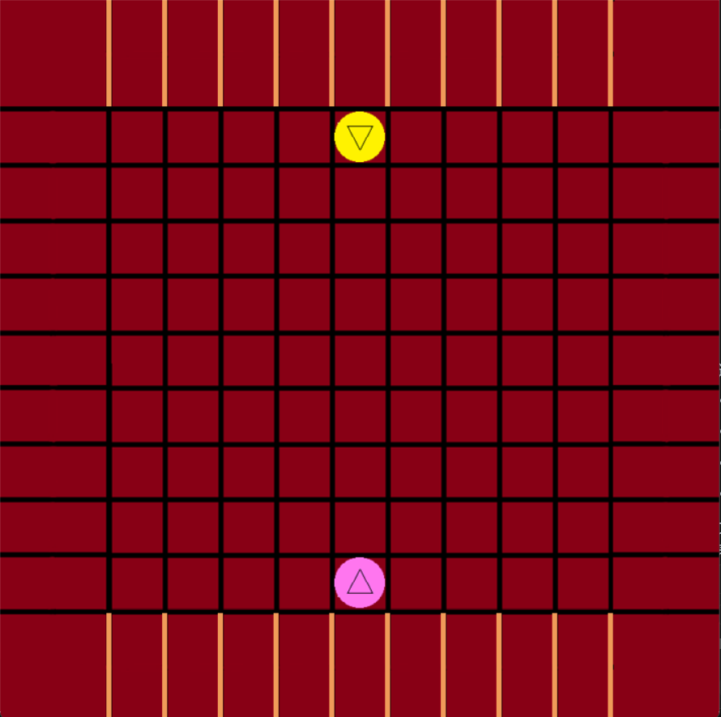
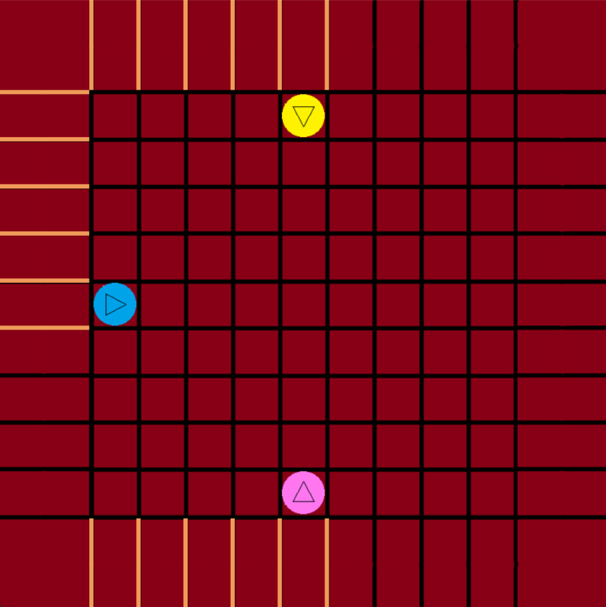
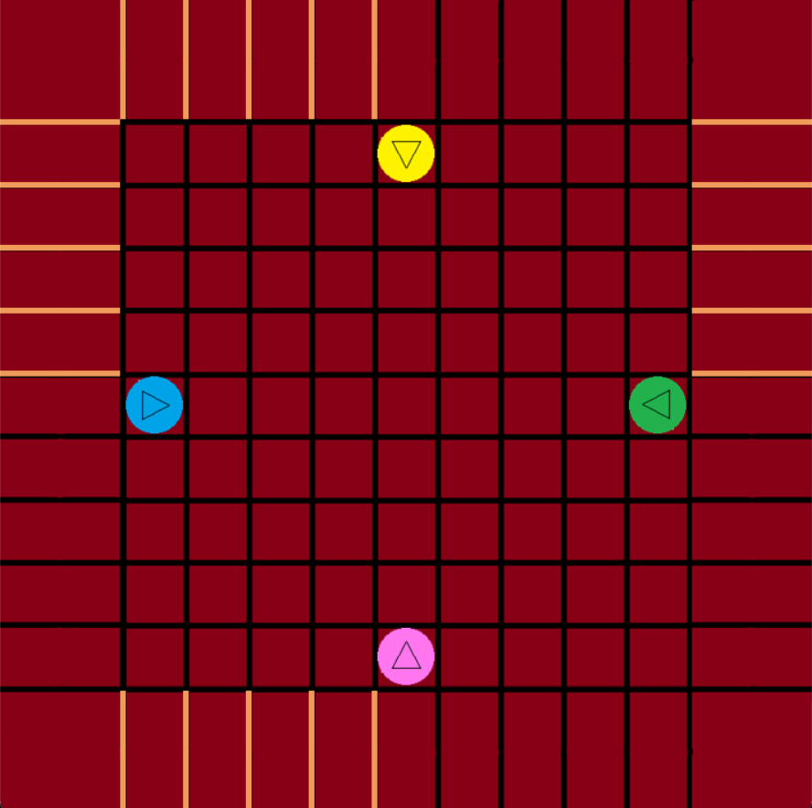

# Quoridor

A strategic board game implemented in Python using Pygame where players compete to reach their opponent's starting position while strategically placing barriers to block their opponents.

## Game Overview

Step by Step Siege is a tactical board game that can be played with 2-4 players. Each player controls a piece that starts from their respective corner of a 9x9 grid. The goal is to reach the opposite corner while strategically placing barriers to hinder opponents' progress.

## Features

- **Multiplayer Support**: Play with 2, 3, or 4 players
- **Strategic Gameplay**: Place barriers to block opponents while finding your own path
- **Intuitive Controls**: Mouse-based interaction with keyboard shortcuts
- **Visual Feedback**: Clear visual representation of pieces, barriers, and game state
- **Pathfinding Algorithm**: Advanced maze-solving algorithm to ensure fair gameplay


## Game Rules

### Objective
Each player must move their piece from their starting corner to the opposite corner of the board.

### Setup
- **2 Players**: Each player gets 10 barriers


- **3 Players**: Each player gets 6 barriers  


- **4 Players**: Each player gets 5 barriers


### Movement
- Players can move their piece one step in any direction (up, down, left, right)
- Players can jump over adjacent pieces if there's no barrier blocking the path
- Diagonal movement is allowed when jumping over pieces with specific barrier configurations

### Barriers
- Barriers can be placed horizontally or vertically on the board
- Each barrier can only be moved once per game
- Barriers cannot be placed in a way that completely blocks any player's path to victory
- Press SPACE key to toggle between horizontal and vertical orientation when a barrier is selected

### Victory Condition
A player wins by reaching the opposite corner of the board from their starting position.

## Installation

### Prerequisites
- Python 3.x
- Pygame

### Setup
1. Clone or download this repository
   ```bash
   git clone https://github.com/tangty11/Quoridor.git
   ```
2. Install Pygame:
   ```bash
   pip install pygame
   ```
3. Ensure all image files are in the `images/` directory
4. Run the game:
   ```bash
   python game.py
   ```

## Controls

- **Mouse**: Click to select pieces and barriers, click to place them
- **SPACE**: Toggle barrier orientation (horizontal/vertical) when a barrier is selected
- **Close Window**: Exit the game

## Game Interface

- **Menu Screen**: Choose between 2, 3, or 4 player modes
- **Game Board**: 9x9 grid with pieces and barriers
- **Player Colors**: 
  - Yellow (top)
  - Pink (bottom) 
  - Blue (left)
  - Green (right)

## Technical Details

### Game Architecture
- **BoardGame Class**: Main game logic and state management
- **Stack Class**: Used for pathfinding algorithm
- **Maze Solver**: Ensures no player gets completely blocked

### Key Components
- `init_game()`: Initializes game state based on player count
- `maze_solver()`: Pathfinding algorithm to check if players can reach their goal
- `drawGame()`: Renders the game board and pieces
- `gameloop()`: Main game loop handling user input and game logic

### File Structure
```
Quoridor/
├── game.py          # Main game file
└── images/          # Game assets
    ├── background.png
    ├── [color].png  # Player pieces
    ├── [color]back.png  # Selected player pieces
    ├── board_.png   # Horizontal barriers
    ├── boardl.png   # Vertical barriers
    └── [board]back.png  # Barrier back sides
```

## Game Mechanics

### Pathfinding
The game uses a sophisticated maze-solving algorithm to ensure that placing barriers doesn't completely block any player's path to victory. This prevents unfair gameplay where a player could be permanently trapped.

### Barrier Placement
- Barriers can be placed on grid intersections
- The game prevents overlapping or crossing barriers
- Each barrier can only be used once per game
- Barriers must allow at least one path for each player to reach their goal

### Turn System
Players take turns moving their pieces and placing barriers. The turn order is:
1. Yellow (top)
2. Pink (bottom) 
3. Blue (left) - 3+ players only
4. Green (right) - 4 players only


## Development Progress

### ✅ Completed
- **Basic Game Implementation**: Core game mechanics and UI
- **Multiplayer Support**: 2-4 player modes
- **Game Logic**: Movement, barrier placement, victory conditions
- **Pathfinding Algorithm**: Maze solver to prevent unfair blocking
- **User Interface**: Menu system and game board rendering

### 📋 In Progress
- **Code Refinement**: Optimizing existing code structure and performance，preparing for interaction with RL agent
- **RL Training Agent**: Training AI agent using reinforcement learning
- **Human vs AI Mode**: Add computer opponent functionality
- **Enhanced AI**: Multiple difficulty levels and strategies
- **Performance Optimization**: Further code improvements and efficiency enhancements


## Contributing

Feel free to contribute to this project by:
- Reporting bugs
- Suggesting new features
- Improving the code
- Adding new game modes
